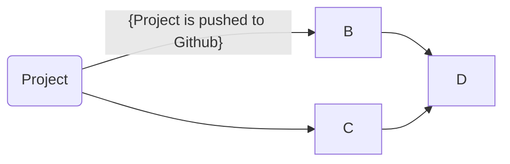

## Dockerize It
- How to install Docker:
	- `sudo apt-get remove docker docker-engine docker.io`
	- `sudo apt-get update`
	- `sudo apt install docker.io`

## Git Actions & Dockerhub
- Create Dockerhub pub repo
	- go to `https://hub.docker.com/`
	- Create an account
	- go to Create Repository
	- Name repo and select Public
	- Create
- Auhenticate
	- I recommend using Access Tokens because they're more secure than just a username and password. Also tokens are more unique to the user.

- Configuring Github Secrets
	`DOCKER_USERNAME` for username and `DOCKER_TOKEN` for password.

- Workflow Behavior
	- When Github Workflow is running, it sets up a job, checksout branch, logs into Dockerhub, builds and pushes image to Dockerhub.
	- Needed to change repository name, username, and password.

## Deployment
- Container restart
	- Stops container
	- Opens ports by removing container
	- Pulls latest image
	- Runs new image
- Webhook task definition file
	- In the definition file, the `id` property gives a name to your hook. The `execute-command` property tells us the command that should be executed when the hook is started. The `command-working-directory` tells us the directory the script is going to be run on.
- Setting up Webhook on server
	- Installation
		- export PATH=$PATH:/usr/local/go/bin
		- wget https://go.dev/dl/go1.19.3.linux-amd64.tar.gz
		- sudo tar -C /usr/local -xzf go1.19.3.linux-amd64.tar.gz
		- go install github.com/adnanh/webhook@latest
		- /home/ubuntu/go/bin/webhook -hooks /home/ubuntu/hooks.json -verbose
	- Listened with `lsof | grep LISTEN`
	- `/home/ubuntu/go/bin/webhook -hooks /home/ubuntu/hooks.json -verbose`
- Setting up notifier
	- Log into Dockerhub
	- Go to your repository
	- Go to Webhooks
	- `http://yourserver:9000/hooks/redeploy-webhook` (e.g., http://44.212.121.166:9000/hooks/hooky) in the repo.

## Diagramming

#BYOB

